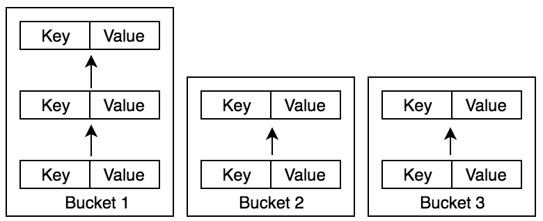

# Hash Tables
A Hash Table is a very commonly used Data Structure, most commonly used
for key value storage. The most popular usage of a Hash Table would be
in a python dictionary.

### Note
You need to know [Linked Lists](../Linked%20Lists) to understand
Hash Tables!

## Buckets and Linked Lists
The basic premise of Hash Tables is that we have these things called
buckets. We will store our data in specific bucket depending on info
we will learn later. Since we want to be able to add data very fast and
we don't partially care about indexing, we will be using Linked Lists
as our Bucket.

## Hashing
Now that we understand the basic premise of a Hash Table, how do we find
which bucket a specific data is suppose to go in?

Hashing is getting a constant "hash" integer for an object. These hashes
are not unique and the algorithm used to get a hash, has to be able to
generate that hash again on the same object.

The has for the string "asdfasdf" will always be constent if we hash it
twice. But if we hash "asdfeq123" then our hash will be different then
the hash for "asdfasdf".

Hashes will change every time you run your script (in python 3) because
of security concerns. But once you run a script every time you hash the
same object inside the script, the hash will stay constant.

## Finding our Bucket
When we want to do anything with an element in a Hash Table, we need to
find the bucket our specific key corresponds to. The way we will do
this is using an algorithm that uses our keys hash. The algorithm goes:

    keys_bucket = hash(key) % number_of_buckets

Since hashes are integers, we can mod the buckets hash by the number of
buckets we have and get the index of the target bucket that the key
should correspond with.

## Adding Data
Now that we have our specific bucket for our key, let's add the key and
value to our bucket.

Like I said, the first thing we have to do is get the bucket that our
key corresponds with. Since our buckets are Linked Lists all we have
to do is just add our key value pair to the linked list in the form of
a tuple (or in languages without tuples, we can have an Object that
stores our key and value).

If we get two elements in the same bucket, it's called a collision. We
will handle collisions by just appending the key value pair to our
Linked List. But sometimes instead of appending onto the end of the
Linked List, people will find the next open bucket and add the key value
pair to it. We don't like this, so we will just append to our Linked
List.

## Search, Modify, and Deleting
If we have a key and want to find a value, it's quite simple. We first
get the intended bucket of the key using our algorithm above. Then we
iterate through our Linked List until we either find a tuple or object
that our key is the same, or until we hit the end of the Linked List. If
we find the tuple then we can just return back the value from that tuple
or object.

If we want to change the value of a key. Then all we would have to do is
find the node in which our key corresponds to (doing the way above).
Then once we found the node, just set the value to our new value.

Now if we wanted to delete the node, we just find the node just like we
did in the two examples above, and delete that node from our Linked
List.

## Number of Buckets vs Length of Bucket
The things that can slow down our Hash Table have to do with the number
of buckets and the length of each bucket.  We don't want so many buckets
that we are creating unnecessary memory allocations, and we don't want
long Linked Lists that we have to iterate thought O(n)ly. The most
efficient way possible is to have just enough buckets that our Linked
Lists only have a few elements. This is so we utilize all our buckets
and we don't have long lookups in our Linked Lists. But this problem
goes down to the memory vs speed argument which we will not get into.

The number of buckets we initially assign is very important because
changing the number of buckets on the fly would require re-bucketing all
our data inside our Hash Table. So choose the number of buckets wisely
(I'm sure you can find an algorithm or something that walks you thought
how exactly to assign bucket lengths, but that isn't what this article
is about).

## Conclusion
Hash Tables are a VERY efficient way to store key values pairs. This is
evident by looking at all the built in data structures in most languages
which use a system like this to implement dictionaries and so on. They
are quite simple to understand and are quite simple.