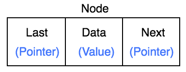
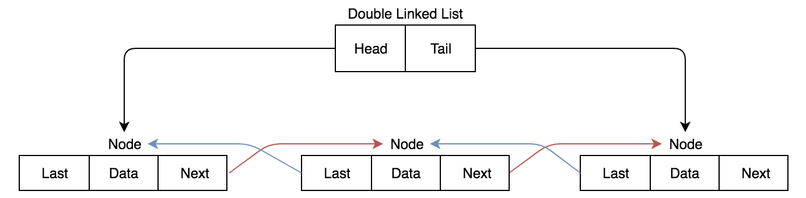

# Linked Lists
Linked Lists are a way to store data in which appending and prepending
data is very fast. While looping through the data can be quite slow. A
linked list is basically a chain of Nodes attached to each other.

## Reference vs Value
The first concept we need to understand is the concept of Reference vs
Value. In most computer science languages, there are two things a
variable can be. It can either be a value like 1, 2, 3, 4... Or a
reference to an object. What I mean by a reference is the value of the
variable will be the location in which your object resides.

#### Value
If you pass variables by value, assigning a new variable to a value
variable will give you a new variable with that constant value. Let me
show you how this works. Say you have a variable `a` with is equal to
`5` if I assign variable `b` equal to variable `a` then change variable
`a` to `7`, variable `b` will not change value. This is because these
variables are passed by value. Mortifying one does not change the other
because  when we assign b, we set it to `5` instead of the value that
`a` has.

    a = 5
    b = a

    print(a) # We get 5
    print(b) # We get 5

    a = 7

    print(a) # We get 7
    print(b) # We get 5 because a was passed as a value not reference

#### Reference
If you pass a variable by reference, assigning a new variable to your
current then changing your first will also change it for the second. The
reference is just where the object is stored, and assigning a new
variable to your initial variable will just give our new variable the
reference to the first variable and modifying the second variable will
effect the variable but not the reference.

Say we have a variable `a` which is a list of integers and we assign
variable `b` to variable a. If we remove an element off the list in
variable `b` it will affect variable `a` because we modify the object
that both variable `a` and `b` reference too.

    a = [1, 2, 3]
    b = a

    print(a) # We get [1, 2, 3]
    print(b) # We get [1, 2, 3]

    del b[0]

    print(a) # We get [2, 3]
    print(b) # We get [2, 3]

We call variables that pass by reference a pointer because it points
to an object.

#### Extra
The reference vs value struggle is more apartment while coding in a
language like C++ in which you can request either a pointer (reference)
or actual value of a variable.

## A Node
The first thing we have to understand when creating a Linked List is
something called a node. A node is used in multiple data structures in
many different ways, but the concept of a node is the same. Nodes are
used to store data and link to one or more other nodes.

Our node is going to have to elements. The first element of our node is
going to be a data variable. This variable will be the element we want
our Linked List to store. Then we will have a next variable which will
point to the next node in our Linked List (or None if we don't have a
next).

The next variable in our Node is a pointer to the next Node in our
Linked List. While the data variable could either be a pointer or value.

^ The diagram above is kinda wrong. The data variable could either be
a reference or value.

## Constructing our Linked List
Now that we have a node, what do we do with it? Well we construct our
Linked List. How a Linked List works is we have something called a
head node which is a reference to the first node in our Linked List. We
also have a  variable called tail which is a reference to the last node
in our Linked List.

So our Linked List is setup like:

Our Linked List will look like something like this:

## Linked List functionality
There are four main functions inside a Linked List. We have our prepend
(add data to the beginning of the List), append (add data to the end of
the list), find (find a data element in the List), and delete (delete a
node from the List).

#### Prepend
Prepend is quite a simple function. We start everything by creating a
new node with its data variable defined. If our Linked List is empty
then we set the head and tail to the reference of our node. If our
Linked List is not empty, we set the next variable to the reference
of the current head, and then set the head of our Linked List to our
node that we just created. This function should run at O(1).

#### Append
Append is just like prepend, but we do add our node to the end of the
Linked List. Like before we start by creating a Node. If our Linked List
is empty then we assign the head and tail to our new node. If the list
is not empty, we set the next variable in our current tail to the
reference of our new node. Then we set the tail of our Linked List to
the node we created. This function should run at O(1)

#### Find
We first get the head, and we get the next node using the next reference
and we keep doing this until we have a node in which either our find
function is true, or until we hit a next variable that is None. This
function should run at best O(1) at worst O(n).

#### Delete
The most complicated of all the Linked List functions, but still quite
simple. Like the find function, we get the head and keep getting the
next node until we find the node we are looking for. Once we find the
node we are looking for we set the last nodes next variable to the next
variable in the node you want to delete. If the node was the list's
head, assign the next variable to the next head. If the node was the
tail, assign the tail to the reference to the last node.

## Doubley Linked List
A Doubly Linked List is just a regular Linked List but instead of the
node having just a next and data variable, we add in a variable last.
This last variable will be a reference to the last node in the Linked
List.

^ Data could be either a reference or value.

We don't have anything changed internally inside Linked List but now
we can loop through our Linked List backwards and do some things a
little easier (we won't go into that).

## When to use a Linked List
- We care about order
- We don't care about indexing