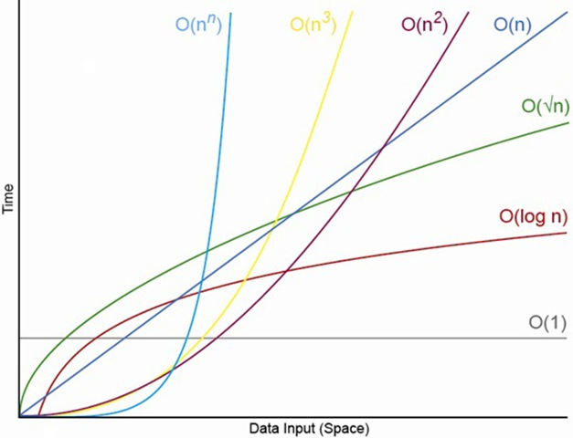

# Big O

Big O is used for describing the complexity and performance of an
algorithm. With Big O we can get something called the best, average, and
worse case of an algorithm.

The best way to understand Big O is by just doing Big O. So let's try
to decipher this.

### O(1)

    a = 5
    b = 5

    c = a + b

The algorithm above is O(1). This is because our code runs at constant
time. We don't have to iterate through any loops, and we don't have to
create any big memory allocations. Anything that is a constant (adding,
multiplying, if statements, ext) are O(1).

### O(n)

    words = ['Dog', 'Deer', 'Beer']
    big_word = ''

    for word in words:
        big_word += word

The algorithm above is O(n). This means that we loop through a list only
once. n is a variable that represents the number of words in a list. If
we would comment on every line describing it's complexity we would get
the follow.

    words = ['Dog', 'Deer', 'Beer'] # O(1)
    big_word = '' # O(1)

    for word in words: # O(n)
        big_word += word # O(1)

As we see from above, everything has it's own notation. What our O(n)
actually means is something different then the actual complexity of our
algorithm. Our actual complexity is n + 3, but with Big O notation you
drop all constants. To get the actual complexity of an algorithm just
state the complexity of the line and add everything together. That means
if we have too loops that run after each other, our Big O will still be
O(n).

    words = ['Dog', 'Deer', 'Beer'] # O(1)
    big_word = '' # O(1)

    for word in words: # O(n)
        big_word += word # O(1)

    for word in words: # O(n)
        big_word += word # O(1)

The Big O complexity of the code above is still O(n), but the actual
complexity is 2n + 3. But like before, you drop all the constants when
going into Big O notation.

### O(n^2), O(n^3), O(n^4)...

As we saw from the O(n) section, we state that when getting complexity
we just add everything together. But what will happen if we have a
nested loop?

    numbers = [1, 2, 3, 4, 5] # O(1)
    names = ['Avery', 'John', 'James'] # O(1)
    random_string = '' # O(1)

    for number in numbers: # O(n)
        for name in names: # O(n)
            random_string += str(number) + name + " " O(1)

We have a loop inside of a loop now! What happens to our complexity?
Well when we have a loop, the depth of the loop (the amount of loops)
is n ^ (the amount of loops). So in our example above, n is to the
second power because we have a n inside a n. So our complexity would be
n^2 + 4. Our Big O would be O(n^2). Now what would happen if we have
another loop.

    numbers = [1, 2, 3, 4, 5] # O(1)
    names = ['Avery', 'John', 'James'] # O(1)
    things = ['Bat', 'Hat', 'Cat'] # O(1)
    random_string = '' # O(1)

    for number in numbers: # O(n)
        for name in names: # O(n)
            for thing in things: # O(n)
                random_string += str(number) + str(thing) + name + " " O(1)

We now have a loop inside of a loop inside of a loop! Since we have two
loops inside of a loop our complexity is n^3 + 5 and our Big O would be
O(n^3). The amount of loops we have is the exponent to our n. Now what
would happen if we have a loop after all of this?

    numbers = [1, 2, 3, 4, 5] # O(1)
    names = ['Avery', 'John', 'James'] # O(1)
    things = ['Bat', 'Hat', 'Cat'] # O(1)
    random_string = '' # O(1)

    for number in numbers: # O(n)
        for name in names: # O(n)
            for thing in things: # O(n)
                random_string += str(number) + str(thing) + name + " " O(1)

    sum = # O(n)
    for number in numbers: # O(n)
        sum += number

The above codes complexity would be n^3 + n + 5. So would our Big O be
O(n^3 + n)? No, we just take the biggest exponent. This means our Big O
would just be O(n^3).

### O(n log n)

We get a n log n algorithm when we loop through a loop once then loop
only through it again logarithmically. An example of this would be
finding if two numbers in a list add up to a sum.

    numbers = [1, 2, 3, 5, 7]
    sum = 8

    for x in range(list_length): # O(n)
        for y in range(x, list_length): # O(log n)
            if numbers[x] + numbers[y] == sum:
                print(str(x) + "+" + str(y) + " makes " + str(sum))

We loop through once then the second time we move our index up by one
so we don't have to redo a check that we already did. This makes it
O(n log n).

### O(2^n), O(3^n), O(n^n)

The only real way to get O(2^n) is in a recursive algorithm, in which
every call branches into two parts. It's exponential. An example of this
would be making an algorithm to get a Fibonacci number.

    def fibonacci(number):
        if number <= 1:
            return number;

        return fibonacci(number - 2) + fibonacci(number - 1)

Every time we call the method it creates two more calls. This is the 2
in O(2^n). Hypothetically we can keep doing this and calling me times
to get to O(n^n). This really never happens, and should really never
happen. Mainly away from anything to the nth power.

### Best, Average, Worse

I might have been fulling telling the truth before. Our Big O complexity
was what I said, but I didn't state it the way I should of. With Big O
we can have something called, best, average, and worse cases.

All of our last examples our best, average, and worse case were the
same case. The algorithm would always be what our Big O described. We
can get it so our best case and worse case are different.

    numbers = [1, 2, 3, 4, 5]

    for number in numbers:
        if number == (some number):
            break

The code above's worst case is O(n) because if the number we are looking
for is the last number or doesnt exist then we have to run through our
full list. The best case is O(1) because if the number we are looking
for is the first number then we break out of the loop before anything
happens.

We can then have an average case if we have something that has a worse
case and best case but we have an average which is what happens the
most.

### Big O and beyond

The reason we use Big O is to calculate the complexity of our code. We
want our code to be the closest to O(1) as possible. We want very little
iterations of n, and we want to keep reducing it. That's why O(n log n)
is way better then O(n^2).

Big O is good for getting the ORDER of complexity of an algorithm. When
it comes down to it, Big O is great in getting the broad efficiency of
an algorithm. But in big companies somethings Big O isn't enough and
they just look at the complexity as a whole. But this is only for
products and companies that have to handle tons and tons of users and
data.

The graph above shows the efficiency of the Big O possibilities with the
y axis being time and the x axis being number of elements. Sometimes
more iterations over n is actually more efficient. Imagine O(2^n) is
walking, O(n^2) is driving, and O(n log n) is flying. To get across the
street it's faster to walk then to drive. You have to get your car then
drive across the street then park it, while you could have just walked.
But once you have to get across town it takes way longer to walk then
drive. Then to get across the country its faster to fly then to drive.

The Big O notation is like the type of transport and the complexity that
we write (like n^3 + 2n + 3) is like the brand of vehicle. In the end
taking a plane (n log n) will always be faster then driving (n^2). But
sometimes we need a Ferrari (n) over a Ford (2n).

### Wrap Up

We have gotten the basic premise of Big O. The thing is we only covered
6 of the 8 possible outcomes. The remain four are either vary rare or
very special cases. If you would like to look into them more, then by
all means do it. I personally think the things I described are the only
things you need. Hopefully now you can go get the Big O of all your
code.

