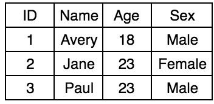

# SQL
SQL also known as Structured Query Language is a language that lets you
access and manipulate data bases. In this article we will be learning
the basics of SQL. If you would like to learn more about SQL I HIGHLY
recommend the book
[Head First SQL](http://shop.oreilly.com/product/9780596526849.do).

## Relational vs Non Relational Databases
The first thing we have to understand about SQL, is that it's a
Relational Database Management System. This means we store data in
tables and rows. While on the other handle, Non Relational Databases
like MongoDB represent data in collections.

There are lot's of pros and cons of each type, but today we will just
focus on Relational Databases.

## Databases
Creating a Database is quite easy. We just need to create a query that
is `CREATE DATABASE` then the name of the database we want to create.
So something like:

    CREATE DATABASE Test

If we want to delete that Database we just use `DELETE DATABASE`. We
would do something like:

    DROP DATABASE Test

## Tables
Since SQL is Relational Database Management System, we use Tables to
store our data. A table is a row column system in which our columns are
specific elements types (name, age, gender), while rows are the values
for the colors (Avery, 18, Male). We also use key identifiers to
identify specific rows. We use something called primary keys which are
unique integer keys.

Here is an example of what a Table Might look like:

Our first row shows the names of each column, and then each row has a
specific person.

#### Column Types
In SQL there are tons of data types. The most common would be Varchar
which is a Variable Character Field or a string and int which is just an
integer. But there are tons of different types, and you can read more
about them [here](https://www.w3schools.com/sql/sql_datatypes.asp).

#### Creating a Table
Since SQL is a Query Language, to create a Table we have to construct a
Query to create a Table. Say we want to create a Table called People
which has the columns ID (Integer), Name (Varchar), Age (Integer), and Sex
(Varchar). The following would be our query:

    CREATE TABLE People (ID int NOT NULL, Name varchar(100), Age int(3), Sex varchar(20), PRIMARY KEY (ID))

We say `CREATE TABLE People` to create a table named People. Then inside
the quotes we add the columns we want and separate each column by a
comma. For the columns we first declare the name, then the type (and the
length of the type something), then after those we can add special
things. At the end of our query we put `PRIMARY KEY (ID)` to
declare ID as our Primary Key.

#### Deleting A Table
To delete a table it's quite simple. Just use `DROP TABLE` then the
table name. Say we wanted to drop out People table, we would do:

    DROP TABLE People

## Manipulating our Table
Say we no longer wanted a column, or wanted to add another column, we
can create a query to do that. The most common things we would do to
a table would be to delete, add, or motify a column. Let's construct
some queries.

Say we wanted to delete or drop a column. We start our query with `ALTER TABLE`
then the name of the table. Then we add `DROP COLUMN` then the column we
want to drop. An example query would be:

    ALTER TABLE People DROP COLUMN Age

Now say we wanted to add a column. Again our we start our query with
`ALTER TABLE` then the name of our table. Then we add to the query
`ADD COLUMN` then the column name and info on it. An example query would
be:

    ALTER TABLE People ADD COLUMN Age int(3)

Finally let's say we want to mortify an existing column. We start with
`ALTER TABLE` then the name of the table. Then we add `ALTER COLUMN`
the name of the column we want to modify then the new type we want to
assign it to. An example would be

    ALTER TABLE People ALTER COLUMN Age varchar(20)

Note: For SQL it's `ALTER COLUMN` but with MySQL we use `MODIFY COLUMN`.

## Inserting Data

## Finding Data

## Updating Data

## Deleting Data

## The Great Beyond

#### Foreign Keys

#### Multi-line

## Conclusion